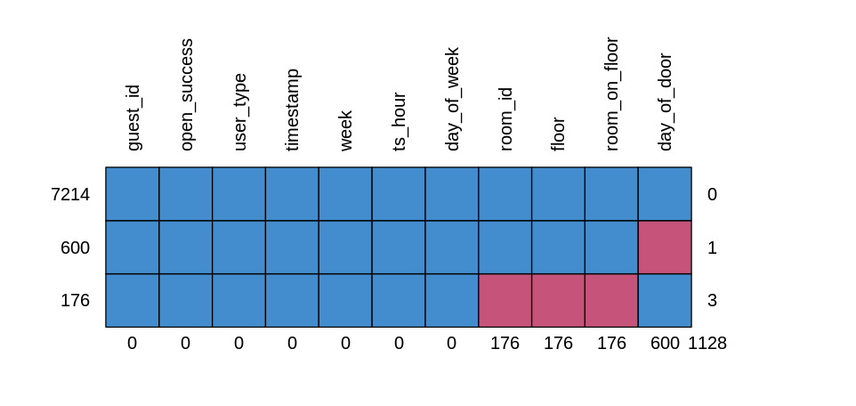
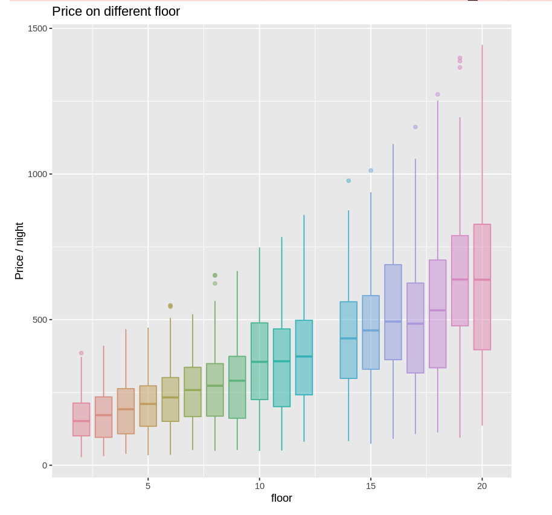
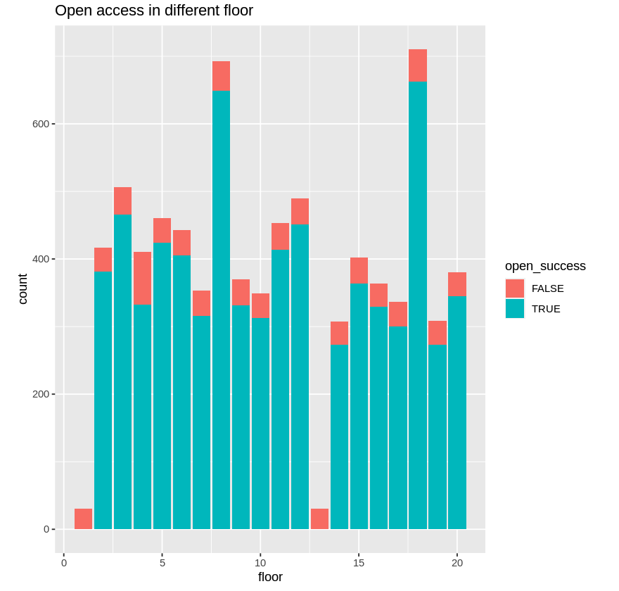

# Hotel
Data Analysis of a Fictitious Hotel Data created by Michael John Davis

This project is to simulate the whole process of data analysis and find the stories behind the data. The process include: analysis of missing data, data cleaning, data visualization, data analysis, storytelling and suggestion. Several interesting stories have been found:

 1. Customers without room id pay higher price for privacy.
 2. A thief stole the key card and tried to access every room in the hotel, but was rejected.
 3. One of the room's door locks is not responding properly and requires multiple attempts by the user to open.
 4. Rooms with even numbers are more expensive than rooms with odd numbers because of the sea views.

More stories can be found in the file.

## Package
```bash
install.packages("mice")
```

## Data Visualization

<p align="center">
   
</p>

<p align="center">
   
</p>

<p align="center">
   
</p>
